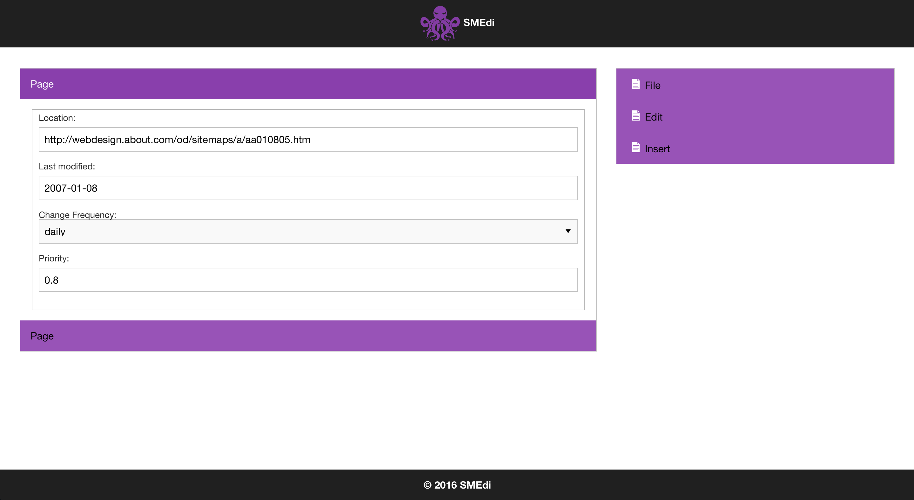
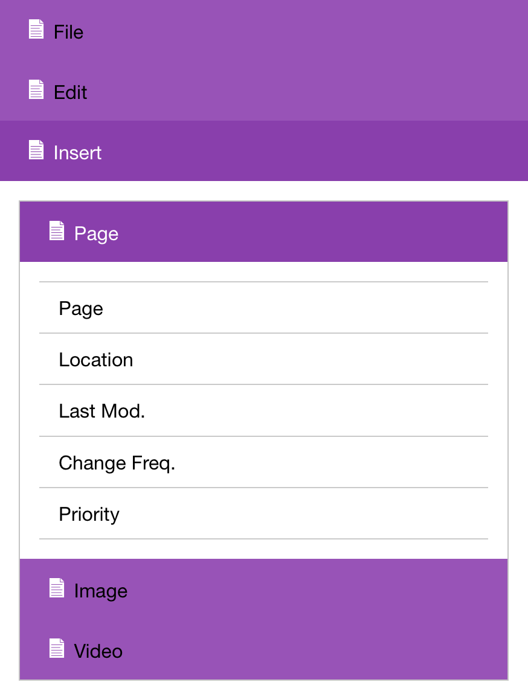

# SMEdi -- The Sitemap Editor

Coming soon...A web application solution to creating XML sitemaps.

## Description

SMEdi is a sitemap editor web application powered by Zurb's Foundation for Apps and AngularJS. It effectively and efficiently allows a user to generate a compliant XML sitemap for their website to be used by search engines such as Google, Bing, Yahoo, etc.

### Requirements:
  * Have a website and a Google Search Console/Webmaster Tools account.
  * A sense of humor.

## Installation

You will need to install this manually:

1. Unzip the archive and place the 'smedi' folder into the root directory of your server.
2. Type in the SMEdi url into your browser. For example: http://your-site-here/smedi
3. Enjoy!

## Resources
* [Foundation For Apps](http://foundation.zurb.com/apps.html)
* [AngularJS](https://angularjs.org/)

## Frequently Asked Questions

#### Where is my generated sitemap.xml file located?
Coming soon...
#### What am I suppose to do with the generated sitemap.xml file?
Coming soon...
#### Do I really need a sense of humor?
No, not really, but it couldn't hurt.

## Screenshots

1. What SMEdi looks like.

2. What the menu looks like.

## Contributors
* [Ammo](http://www.linkedin.com/in/ammocan)
* [Roan](http://www.linkedin.com/in/roan-horning-7b625a17)

## Changelog

#### 1.0
* Start version.

